# SimpleNet-CIFAR

Implementation of a convolutional neural network, SimpleNet in Python using Pytorch. CIFAR-100 dataset is used for training and testing the model. CIFAR-100 has 100 classes, and each class contains 600 images. The dataset contains 32x32 color images. For this implementation (SimpleNet), the images are resized to 3x227x227.

## Implement the basic network, train it for 10 epochs.

Summary of network: 

```
---------------------------------------------------------------- 
Layer (type)        Output            Shape Param
================================================================
Conv2d-1        [-1, 64, 114, 114]      1,792 
MaxPool2d-2     [-1, 64, 57, 57]          0 
Conv2d-3        [-1, 128, 29, 29]       73,856
MaxPool2d-4     [-1, 128, 15, 15]         0
Conv2d-5        [-1, 256, 8, 8]         295,168
MaxPool2d-6     [-1, 256, 4, 4]           0
Linear-7        [-1, 1024]              4,195,328
Linear-8        [-1, 1024]              1,049,600
Linear-9        [-1, 100]               102,500
================================================================
Total params: 5,718,244
Trainable params: 5,718,244
Non-trainable params: 0
---------------------------------------------------------------- 
Input size (MB): 0.59
Forward/backward pass size (MB): 9.15
Params size (MB): 21.81
Estimated Total Size (MB): 31.55
----------------------------------------------------------------
```


### Training and Validation Loss with respect to Epochs

The network was trained on 10 epochs and below is the training and validation loss values with respect to epochs.

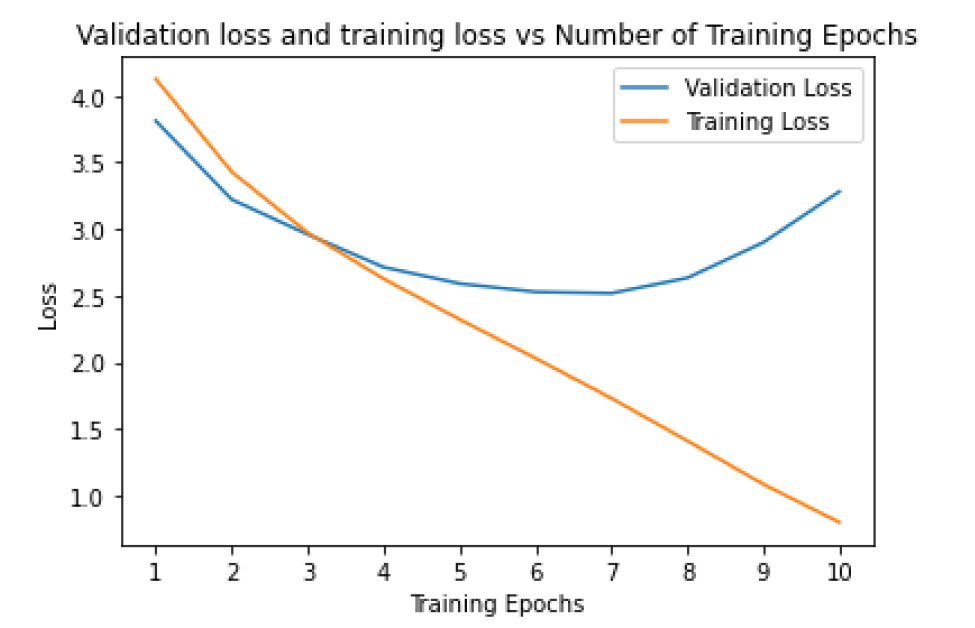
Shows the Training and Validation Loss of SimpleNet against the 10 epochs.

We can observe from the training and validation loss plot that the model start overfitting just after epoch 6. The major reason for over-fitting would be smaller dataset. Since, we only have 500 train images for a single class hence, the model over-fits quickly. So, to improve the network, different techniques can be used for reducing the over-fitting. One way to reduce over-fitting would be to use data augmentation.

## Variation 1: Data Augmentation and Data Normalization

To improve the training and decrease the over-fitting, I applied different data-augmentation techniques to transform the data along with data normalization. For validation set only data normalization was applied. For Augmenting the training data, I used the following transformations:

1. I applied a transformation of random cropping of size 3x32x32 with a padding of 4 on the original image size 3x32x32. Padding was used to increase the size of the image and a random crop of 3x32x32 was applied.
2. Applied a transformation of random horizontal flip with 50% probability to flip the training image.
3. Applied a transformation of random rotation with an angle of -15 to +15 degrees.
4. Finally, I applied a data normalization on the training data by subtracting the mean and dividing by the standard deviation of pixels across each channel.
For evaluating the effect of each transformation on the performance of the network, I performed 4 different trials in which, I trained the network with only one of the transformations. The performance of each trial is mentioned in the below section.

### Training and Validation Loss with respect to Epochs

As expected, for each trial i.e., with a different data transformation, the over-fitting of the model decreased. As evident from the plot, over-fitting is greatly reduced when we apply all the transformations together (Fig. 2 (d)). However, when applied individually, the over-fitting is best decreased by applying random crops on the training data (Fig. 2 (a)).

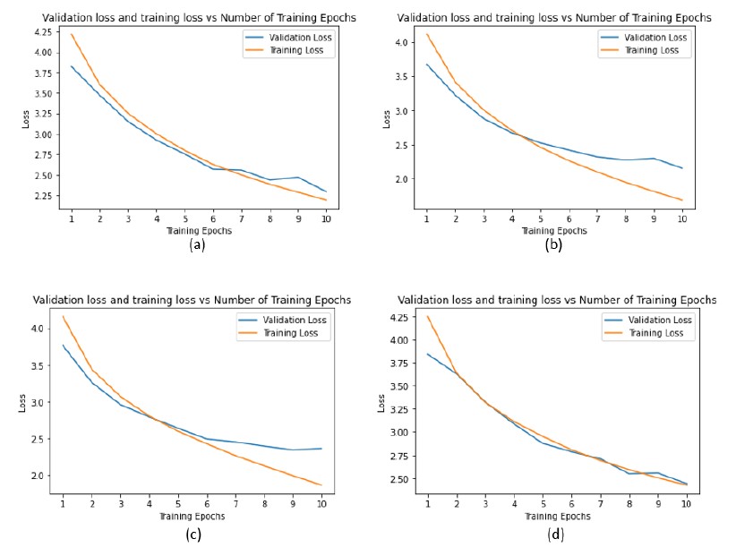
The figure shows the Training and Validation Loss vs Epoch for (a) With only random crop, (b) with only horizontal flip, (c) with only random rotation, (d) with all transformations.

## Variation 2: Modifying Architecture

To further improve the performance of the model, I made changes in the architecture to include more convolutional layers, changed filter size, and studies the effect of adding multiple layers before max pooling layer i.e., two 3x3 convolutional layers without spatial pooling in between would have an effective receptive field of 5x5, while three such layers would have effective receptive field of 7x7. I performed 4 different trials with different network architectures and compared the performance.

### Training and Validation Loss with respect to Epochs

The performance of network architecture is shown in the training loss and validation loss curve for each trial. Since, adding more layers on top of the pervious architecture (SimpleNet), will increase the number of parameters to be trained, hence, the loss curve for 10 epochs might not represent the actual performance. To check how the trained model is performing, I also trained it for another 20 epochs (total 30 epochs). The loss plot can be found in the notebook – “Assignment 1 Variation 2 - Architecture [Final]”


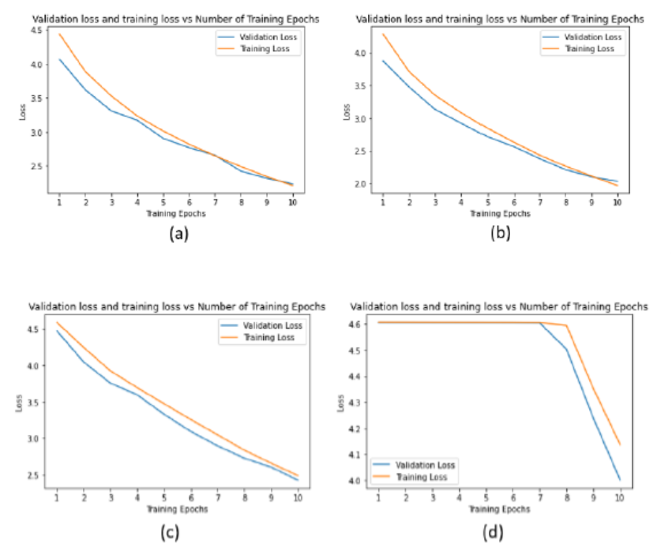
The figure shows the Training and Validation Loss vs Epoch for (a) Trial 1, (b) Trial 2, (c) Trial 3, (d) Trial 4.

It can be observed for the above plot that even after 10 epochs, the validation and training loss was still decreasing. Also, since the trial 4 had the greatest number of parameters, the loss only starts decreasing gradually after epoch 7.

As already discussed in the above section, the architectures of trial 4 and trial 3 have more parameters hence, the performance does not improve in first 10 epochs. If trained to convergence, trial 4 and trial 3 might outperform the other trials.

## Variation 3: Optimizers

For the Variation 3, I used more advanced optimizers instead of using stochastic gradient descent. Also, I experimented with different learning rates for these optimizers as well. Choosing a better optimizer for deep learning model can decrease training time significantly, as the optimizer would be able converge sooner than other. Hence, for this variation I tired Stochastic Gradient Descent, Adam, and relatively newer optimizer Adabound. Below are the three different trials:
1. Trial 1: SGD with learning rate 0.01
2. Trial 2: Adam with learning rate 0.001 and weight decay of 0.0001
3. Trial 3: Adam with learning rate 0.0001 and weight decay of 0.0001
4. Trial 4: Adabound with learning rate 0.0001 and weight decay of 0.0001


As discussed in the above section, the greater number of parameters leads to slow convergence of the trained model. So, changing the optimizer should be able to make the convergence of the model faster.


### Training and Validation Loss with respect to Epochs

The below plot shows the training and validation loss curve with respect the epochs for different trial. It can be observed that the curves for training and validation for trial 1 (SGD, lr = 0.01) and trial 2 (Adam, lr = 0.001) are quite similar, however SGD still performs better than in terms of the accuracy. Based on training for 0 epochs, SGD was able to converge quicker than the Adam and Adabound optimizers.

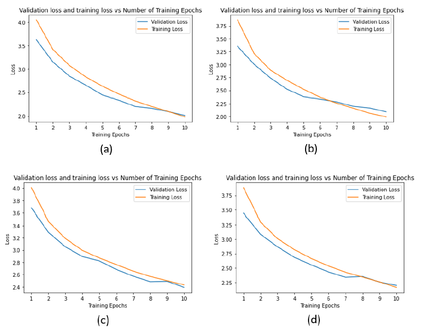
The figure shows the Training and Validation Loss vs Epoch for (a) Trial 1, (b) Trial 2, (c) Trial 3, (d) Trial 4.

the performance of SGD (lr = 0.01) and Adam (lr = 0.001) are very close to each other. As in Adam algorithm, learning rate is maintained for each network weight and then separately adapted as the training epochs increase, a better view of the difference between the performance of Adam and SGD can be observed when training epochs are more than 10.


## Variation 4: Batch Normalization

To further improve the performance of my model, I modified the architecture used in variation 2 trial 2. The following changes were made on the architecture:
1. Added Batch Norm before every ReLU activation.
2. Added a convolutional layer of channel size = 32 at the beginning of the network with kernel size of 1, stride of 1, and with zero padding.
Adding batch normalization normalizes the inputs to a layer for each mini-batch and hence should reduce the number of epochs for training the network.


### Training and Validation Loss with respect to Epochs

The below plot shows the training and validation loss curve with respect the epochs. It can be observed in the loss plot below that the validation and training loss was further decreased by just adding the batch normalization before applying the ReLU activation.

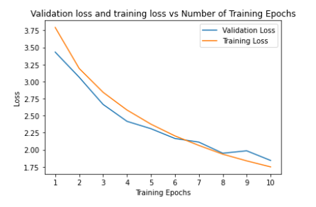
Shows the training and validation loss curve for Variation 4.


## Variation 5: Residual Connection

To further improve the performance of my network, I added residual connections after every two convolutional layers, along with batch normalization and ReLU activation. Adding residual connections should improve the training speed of the network, allow me to increase the depth of the network while resulting in less extra parameters.

### Training and Validation Loss with respect to Epochs

It is interesting to note from the training and validation loss curve in the figure below by adding the residual connections, the validation curve becomes more noisier than the previous model, however, after 10 epochs, the network with residual connections performs better than the previous networks.


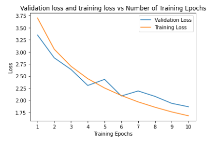
Shows the training and validation loss curve for Variation 5 with Residual Connections.

## Variation 6: Final Architecture

For the final architecture, I modified the architecture development in Variation 5, since architecture in variation 5 included all the good changes from the previous variations.

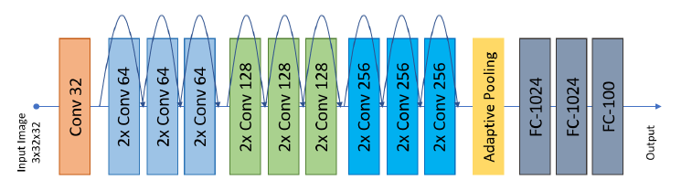
Shows the Convolutional and Residual Blocks of the Final Architecture

The final architecture comprises of 1 convolutional block and nine residual blocks. Each of the residual blocks have two convolutional layers along with batch normalization, and activation function. Each residual block has a residual connection that is added back to the second convolutional layer of the block before applying activation function. If the size of input channels is not equal to size of the output channel of the residual block, then the convolutional layer is applied to the residual connection to make the size of equal. Figure 7 shows the architecture implemented. Internal layers of the residual block are shown in the below figure.

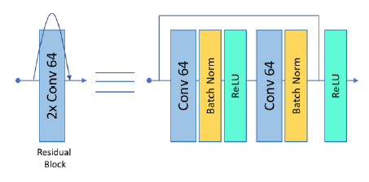
Shows the Convolutional layers of Residual Block.

### Training and Validation Loss with respect to Epochs

To compare with the other variations, the final architecture was first trained only for 10 epochs. The training and validation loss curve shown in the below plot illustrates that the validation and training loss are gradually decreasing even at 10th epoch. By looking at the loss plot, it can be understood that the deeper residual network architecture performs better than the residual network in the variation 5. The network was then trained for 60 epochs to get to the full convergence. The figure 10 shows the training and validation loss of the network when trained till full convergence. The training and validation curve shows that the training and validation loss stops decreasing after ~22 epochs. However, the over-fitting in the model is minimal.


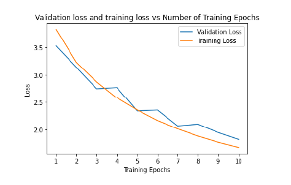
Shows the training and validation loss curve for Final Architecture (10 epochs).

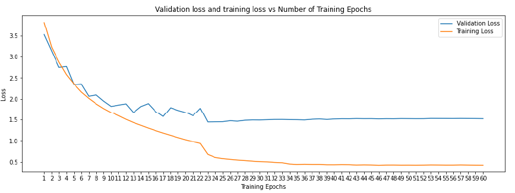
Shows the training and validation loss curve for Final Architecture (60 epochs).

## Top-1 Accuracy for Training and Validation Splits

The below tables show the training and validation top-1 accuracies of all the variations included in this assignment along with the training and validation top-1 accuracy of final architecture trained for 10 epochs and full convergence (60 epochs). Since there are multiple trials in some of the variations, only trials with best performance are included in this table:

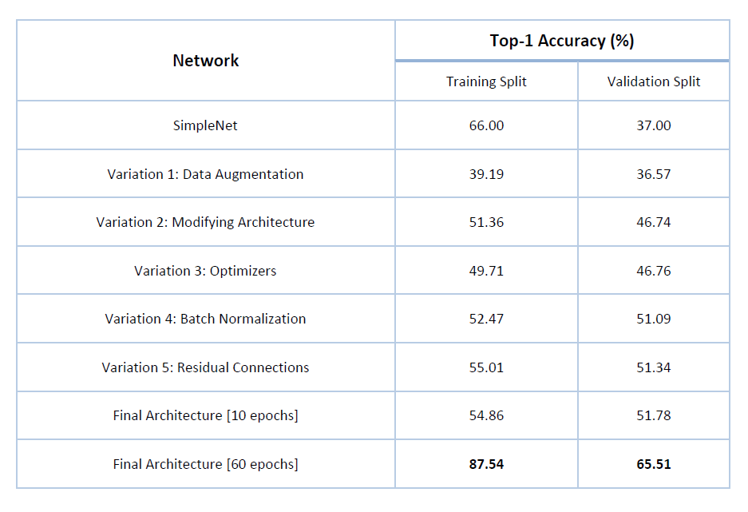


